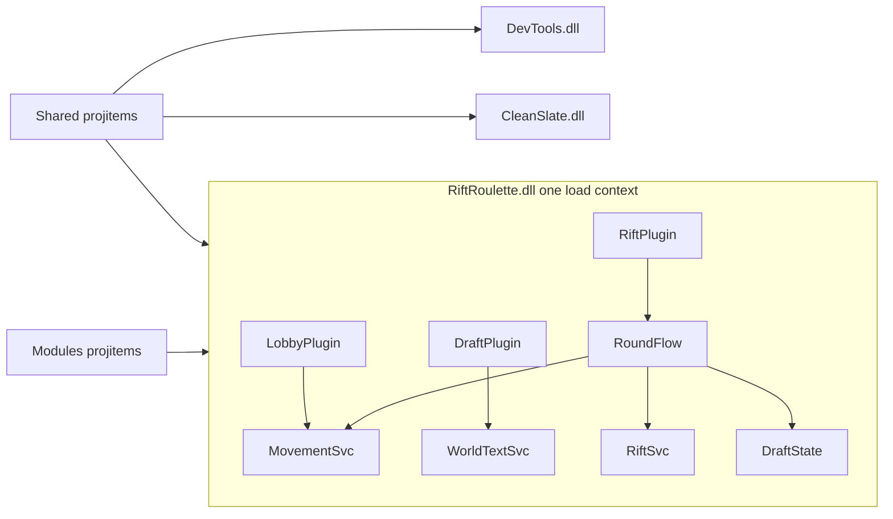

# Bublock — Master Plan

Living roadmap for recreating archive plugins under Bublock and fitting them
into a shared, granular architecture. Update checkboxes as stages complete.
Do not skip stages into a full lifecycle rewrite.

Related:

- Rules: `RiftRoulette/reference/.rules`
- Handoff context: `RiftRoulette/reference/chat-handoff.md`
- Resources / Discoveries: `RiftRoulette/reference/resources.md`
- Behavior oracles: `archive/RiftRumble/`, `archive/DevTools/`, `archive/CleanSlate/`

---

## How we work

```text
master-plan.md (this file)
    → pick next unchecked stage
    → Cursor plan for that stage only
    → implement + docs + catalogs per .rules
    → manual verify (admin command / parity check)
    → mark stage done here; add Discoveries if research found something hard/useful
    → repeat
```

One stage → one Cursor plan → build → verify. No giant multi-stage rewrites.

### Server push policy

**Every push to the live Deadworks server needs the user's approval for
that upload.** The first push (Stage 12, 2026-09-27) replaced the archive
plugins on the server. `Bublock/scripts/update.sh` is build-only and refuses
`--deploy`; the only push path is `scripts/deploy.sh --confirm`, which backs
up the server's `RiftRoulette.dll`, `DevTools.dll`, `CleanSlate.dll` to
`deadworks/server-backups/<stamp>/` first (`rollback.sh <stamp>` restores;
`--no-backup` skips it when the user says so).

### Why archive sources were copied

Stage 1/2 copied archive plugins into Bublock as compiling **parity baselines**.
That is **not** the long-term shape. The RiftRoulette baseline moved to
`RiftRumble/Legacy/` and shrank stage by stage as behavior was extracted into
modules and plugin classes ("strangler" pattern); it was deleted at
Stage 11. Archive stays frozen as the oracle.

---

## North star

- Bublock hosts **many small plugin classes**, grouped for review, not one
  monolith per DLL.
- Reusable, game-agnostic features live in `Bublock/Modules/<Name>/` and are
  compiled into any plugin DLL that needs them (e.g. WorldText, Movement).
- Cross-cutting helpers (Steam-ID auth, `RunWithCheats`, execution mode,
  logging) live in `Bublock/Shared/`, compiled into every Bublock DLL.
- Game-specific features live under the game plugin
  (`RiftRoulette/Lobby/`, `Draft/`, `Rift/`, `Round/`, later `GameLoop/`).
- Tool plugins stay: `DevTools` (discovery / diagnostics), `CleanSlate`
  (map cleanup). They consume `Shared/`.
- Recreate **exact** current functionality from the matching `archive/` plugin.
- Flesh out obvious supporting commands (list, clear, info, where, reset)
  and prefer abstractions that are useful in multiple contexts.
- Future Rift Roulette features (BoX, give-up tuning, etc.) are **seams only**
  until parity is solid.
- Known-good behavior beats pretty code. Especially the KOTH / Rift spawn sequence.

---

## Target layout

```text
Bublock/
  Shared/                  Shared.projitems: Auth, Cheats, ExecutionMode, Logging
  Modules/
    WorldText/             WorldText.projitems: WorldTextService + WorldTextPlugin (dw_wt_*)
    Movement/              Movement.projitems: MovementService + MovementPlugin (dw_mv_*)
    Hud/                   Hud.projitems: HudService + HudPlugin (dw_hud_announce)
    Loadout/               Loadout.projitems: embedded top builds + LoadoutService + LoadoutPlugin (dw_loadout_*, Stage 13b)
    Restraint/             Restraint.projitems: RestraintService + RestraintPlugin (silence / no items, shooting or melee, dw_restrain*, Stage 13h)
    Queue/                 Queue.projitems: PlayerQueue (reusable join queue, Stage 13j)
  RiftRoulette/              RiftRoulette.dll = Shared + WorldText + Movement + Hud + Loadout + Restraint + Queue + game plugin classes
    Lobby/                 LobbyPlugin (connect/disconnect, teams, kick, progression; admin seat + Participants 13f; HeroLock 13g)
    Draft/                 DraftPlugin (hero pools, pick/unpick, enforcement, boards)
    Rift/                  RiftPlugin (spawn / park / watch / cleanup / alternation)
    Round/                 RoundFlow composer (Rift ops + team moves + return to the watch spot) + WatchSpot (13i)
    GameLoop/              GameLoopPlugin + MatchService + MatchConfig + AutoStartService (continuous match loop 13a, hero mode 13b, auto-start 13d)
    RandomMode/            RandomPlugin + RandomModeService (random hero + build every round, Stage 13b; joiners + hero guard 13c)
    Stats/                 StatsPlugin + StatsService (match kills / deaths / assists, stats boards, Stage 13c)
    Balance/               BalancePlugin + BalanceService (auto-balance swaps, Stage 13c)
    Duel/                  DuelPlugin + DuelService (1v1 mode: copied build, hero lock, Stage 13g; queue, winner stays on, 13j)
  DevTools/                DevTools.dll (consumes Shared)
  CleanSlate/              CleanSlate.dll (consumes Shared)
```



Why this shape (verified in Deadworks loader source; see Discoveries in
`resources.md`):

- Each plugin DLL gets its own isolated load context, so separate DLLs cannot
  share statics or make typed calls to each other.
- One DLL may contain many `IDeadworksPlugin` classes; the loader instantiates
  all of them. Classes in the same DLL share statics and typed calls.
- Commands are only discovered on plugin classes inside the loaded DLL, and
  every `plugins/*.dll` is loaded as a plugin. So modules are compiled in as
  source (`.projitems`), not shipped as extra library DLLs.

---

## Architecture decisions (locked)

| Decision | Rule |
|----------|------|
| Multi-plugin | Active work under `Bublock/`; `archive/` is frozen oracle |
| Plugin granularity | Many small plugin classes per DLL (one per feature); each hosts only its hooks and commands |
| Reusable modules | `Bublock/Modules/<Name>/` with `<Name>.projitems`; no Rift Roulette dependencies; service files separate from plugin/commands file |
| Shared code | `Bublock/Shared/Shared.projitems` (Auth, Cheats, ExecutionMode, Logging) compiled into every Bublock DLL |
| Services | Plain C# classes; stateless or static within the assembly; created lazily; never depend on plugin-class load order |
| Timers | `Timer` is a per-plugin instance property; services receive `ITimer` from the calling plugin class |
| Core ops | C# methods on services; real work lives here |
| Composition | Typed C# calls across plugin classes/services inside the same DLL. **Not** via `Server.ExecuteCommand("dw_…")` |
| Commands | Thin `[Command]` / chat wrappers around ops, declared on the owning plugin class |
| Command names | Parity is functionality, not names (SourceMod / CounterStrikeSharp style). Every command runs as `/name` (also `!name`, `dw_name`). Player commands: short verbs (`/pick`, `/unpick`, `/picks`, `/heroes`, `/status`, `/commands`). Admin commands: feature word first (`/rift_start`, `/draft_reset`, `/player_kick`, `/wt_list`, `/mv_tp`, `/ent_find`). Targets are slot numbers. No name collisions across DLLs. Full list: `behavior-inventory.md` §4 |
| Archive command names | Removed in Stage 12 (they were hidden aliases during Stages 6–11); only the new names work |
| Help | Built-in `dw_help` is console-only and lists every visible command; players get `/commands` in chat (Stage 12). Every command sets `Description`; never name a command `help` |
| Admin gate | Every admin command checks `AdminAuth` (null caller = server console, trusted). Archive `/reset`, `/kick`, `/koth`, `/test` and four DevTools commands were ungated; gating them is an intentional difference |
| Deploy | `scripts/deploy.sh --confirm` only (backs up server DLLs to `deadworks/server-backups/<stamp>/`; `rollback.sh <stamp>` restores). `update.sh` stays build-only. Each push needs the user's approval |
| Legacy baseline | `RiftRumble/Legacy/` kept full behavior while Stages 6–10 extracted it (the DLL was always complete); deleted in Stage 11 |
| Round composition | `RiftRoulette/Round/RoundFlow` composes Rift ops with Draft + Movement steps; lifecycle calls it Clean, admin commands Debug (Stage 11) |
| Admin invoke | Debug mode ON |
| Lifecycle invoke | Debug mode OFF (clean) |
| Player commands | Game-state rules; Clean by default |
| Auth | Steam ID set from DevTools oracle — do not invent IDs; lives in `Shared/` |
| Logs | Write on server; Cursor pull root `Bublock/logs/<plugin>/` (migrate from `RiftRoulette/logs/` in logging stage) |
| Docs | Colocated `Foo.md`, feature `FEATURE.md` per module / plugin-class folder, command catalogs per `.rules` |
| KOTH sequence | Do not casually alter the known-good spawn / park / watch / cleanup sequence |
| Deadworks APIs | Verify; never invent schema fields or APIs |

Layer sketch (per plugin class; tools plugins are mostly admin ops):

```text
GameLifecycle  →  composed ops (typed C#, same DLL)  →  service core ops
AdminCommand   →  same service ops (Debug ON)
PlayerCommand  →  same service ops (Clean by default)
```

---

## Per-stage template

Every stage below uses this shape:

- **Goal:** …
- **Inputs:** archive paths / docs …
- **Outputs:** files / commands …
- **Verify:** …
- **Done when:** …

Every stage that adds a module or plugin class also ships its admin/player
commands (including obvious supporting commands), colocated docs, a
`FEATURE.md`, and catalog entries.

---

## Staged roadmap

### Stage 1 — RiftRoulette project shell + deploy tooling

- [x] Done (2026-09-26) — local build only; no server push

- **Goal:** Bublock RiftRoulette builds against workspace `lib/`; update script rebuilds Bublock plugins; deploy tooling prepared but unused until Stage 12.
- **Outputs:** `Bublock/Bublock.sln`, `Bublock/RiftRoulette/` (archive copy), `Bublock/scripts/update.sh`, `Directory.Build.props`, gated deploy
- **Done when:** one command builds Bublock plugins locally; push forbidden until Stage 12

### Stage 2 — Multi-plugin shell (DevTools + CleanSlate)

- [x] Done (2026-09-26) — three plugins build; no server push

- **Goal:** `Bublock.sln` builds RiftRoulette + DevTools + CleanSlate from archive snapshots; docs; still no push.
- **Inputs:** `archive/DevTools/`, `archive/CleanSlate/`
- **Outputs:** `Bublock/DevTools/`, `Bublock/CleanSlate/`, updated solution, `Bublock/logs/<plugin>/`
- **Verify:** `./Bublock/scripts/update.sh` builds three DLLs; `--deploy` refused
- **Done when:** all three plugins build locally under Bublock

### Stage 3 — Shared foundation + Legacy move

- [x] Done (2026-09-26) — local build only; no server push

- **Goal:** `Bublock/Shared/` shared project (`Shared.projitems`) with Auth (Steam-ID gate from DevTools oracle), Cheats (`RunWithCheats`), and ExecutionMode (Clean/Debug). DevTools and CleanSlate consume it with unchanged behavior. Move the Rift Rumble baseline to `RiftRumble/Legacy/`.
- **Inputs:** `Bublock/DevTools/DevToolsPlugin.cs` (`Authenticate`, `RunWithCheats`, authorized Steam IDs), `.rules` §5
- **Outputs:** `Shared/` files + docs + `FEATURE.md`; csproj imports; `RiftRumble/Legacy/`
- **Verify:** `update.sh` builds all DLLs; DevTools commands still gated by the same Steam ID; no behavior diff vs archive
- **Done when:** one shared auth/cheats implementation is used by all Bublock DLLs

### Stage 4 — Logging foundation (Shared)

- [x] Done (2026-09-26) — local tests only; on-server check at Stage 12

- **Goal:** Structured file logging in `Shared/` (master + one log per feature, per-feature prefix, UTC timestamps, affected player name/Steam ID), sessionId/roundId, Clean vs Debug verbosity, retention, per-DLL folder; no `Console.WriteLine` diagnostics in new code.
- **Inputs:** `.rules` § logging; Deadworks loader/config source for file placement
- **Outputs:** `Shared/Logging/` + docs; `Tests/Shared.Tests` + `scripts/test.sh`; `scripts/pull-logs.sh`; CleanSlate converted; DevTools startup/auth logging + `dw_logpath`; `RiftRoulette/Session/SessionPlugin`; server path in Discoveries
- **Verify:** `scripts/test.sh` green (format, templates, levels/mode, master routing, daily/size roll, retention, write-failure fallback); `update.sh` builds; Legacy byte-identical. On-server write + `pull-logs.sh` end-to-end is verified at the Stage 12 push.
- **Done when:** master + feature logs work in local tests; server check scheduled for Stage 12

### Stage 5 — Behavioral inventory + module map

- [x] Done (2026-09-26) — `reference/behavior-inventory.md`; docs only

- **Goal:** Every archive behavior (all Bublock plugins; deepest for RiftRoulette) is assigned to a module or plugin class, a named op, and a command. Propose supporting commands and the parity aliases (`/select`, `/unselect`, `/selected`, `/state`, `dw_koth`, `dw_reset`, `dw_kick`, ...). Decide whether any draft logic generalizes into a module (e.g. a hero-pool picker).
- **Inputs:** Bublock/archive plugin sources; `chat-handoff.md`
- **Outputs:** inventory doc under reference; skeleton catalog entries
- **Verify:** every player/admin-facing behavior is listed with an owner, op, and command
- **Done when:** inventory is the checklist for Stages 6–11

### Stage 6 — WorldText module

- [x] Done (2026-09-26) — local build + tests; in-game check at Stage 12

- **Goal:** Generic in-game boards/text: create, update, clear, and list by id (position, angle, color, scale, font size). Legacy boards route through it with identical visuals.
- **Inputs:** Legacy `CreateBoard` / `CreateBoards`; inventory §1.4, §4, §6 Stage 6
- **Outputs:** `Modules/WorldText/` (service, plugin class, `dw_wt_*` commands, docs, `FEATURE.md`)
- **Verify:** boards render identically to archive; admin commands create/update/clear boards
- **Done when:** Legacy no longer creates `point_worldtext` directly

### Stage 7 — Movement module

- [x] Done (2026-09-26) — local build + tests; in-game check at Stage 12

- **Goal:** Named location registry (position + angle), teleport player / team / all, set view angle. Legacy draft and rift-start teleports route through it.
- **Inputs:** Legacy `MoveToDraftPosition`, `MoveActivePlayers`, `SetPlayerAngle`; inventory §1.5, §4, §6 Stage 7
- **Outputs:** `Modules/Movement/` (service, plugin class, `dw_mv_*` commands, docs, `FEATURE.md`)
- **Verify:** teleports land identically to archive; admin can list locations and teleport
- **Done when:** Legacy no longer teleports pawns directly

### Stage 8 — Lobby plugin class (RiftRoulette)

- [x] Done (2026-09-26) — local build + tests; in-game check at Stage 12

- **Goal:** Connect/disconnect handling, team assignment, kick, starting progression / progression reset, server convar setup from `OnStartupServer`.
- **Inputs:** inventory §1.1, §1.2, §1.6, §6 Stage 8
- **Outputs:** `RiftRoulette/Lobby/` (plugin class, ops, commands, docs, `FEATURE.md`)
- **Verify:** connect/disconnect/kick behave identically to archive
- **Done when:** Legacy no longer owns these hooks

### Stage 9 — Draft plugin class (RiftRoulette)

- [x] Done (2026-09-26) — local build + tests; in-game check at Stage 12

- **Goal:** Hero pools, `/pick` `/unpick` `/picks` `/heroes` (hidden aliases `/select` `/unselect` `/selected`), draft admin commands, hero enforcement on `player_hero_changed` (never `SelectHero` while dead), draft reset, boards via WorldText.
- **Inputs:** inventory §1.3, §1.4, §6 Stage 9
- **Outputs:** `RiftRoulette/Draft/` (plugin class, draft state, ops, commands, docs, `FEATURE.md`)
- **Verify:** draft flow matches archive; user catalog matches implemented player commands
- **Done when:** Legacy no longer owns draft state or commands

### Stage 10 — Rift plugin class (RiftRoulette)

- [x] Done (2026-09-26) — local build + tests; in-game check at Stage 12

- **Goal:** Spawn / park / watch capture|tie / cleanup troopers / green-yellow alternation as separate ops, using Movement for team placement and Draft for team membership. Preserve the known-good KOTH sequence exactly.
- **Inputs:** inventory §1.7, §6 Stage 10
- **Outputs:** `RiftRoulette/Rift/` (plugin class, ops, commands, docs, `FEATURE.md`)
- **Verify:** side-by-side vs archive `koth` flow (spawn, park, move, finish/tie, return, cleanup)
- **Done when:** Legacy no longer owns rift logic

### Stage 11 — Parity composition

- [x] Done (2026-09-26) — local build + tests; in-game check at Stage 12

- **Goal:** A `koth`-equivalent compose path (Clean mode) built from Draft, Movement, and Rift ops; admin wrappers run the same ops in Debug mode. Delete `RiftRumble/Legacy/`.
- **Inputs:** inventory §1.8, §6 Stage 11
- **Done when:** lifecycle and admin paths use the same ops (mode differs only); Legacy removed

### Stage 12 — Parity harden + docs pass

- [x] Done (2026-09-27) — code, docs, and local parity review (2026-09-26); uploaded with approval and server logging verified; in-game checklist run by the user (`reference/parity-review.md`)

- **Goal:** Archive behavior checklist green across Bublock plugins (RiftRoulette primary); FEATURE.md coverage; catalogs and Discoveries up to date. Command items from inventory §6 Stage 12: DevTools renames plus gating of the four ungated commands (`/entity_info`, `/entity_remove`, `/snapshot`, `/compare`), CleanSlate `/cleanup_run`, check players can use `dw_help`, decide on hidden archive aliases.
- **Verify:** side-by-side vs archive; **only after parity green**, first Bublock → server SFTP push; then confirm logging on the server (`dw_dev_logpath` path matches `/server/game/bin/win64/bublock/logs/`, files appear, `scripts/pull-logs.sh` mirrors them into `Bublock/logs/`)
- **Done when:** no known parity gaps left intentional; push policy may be unlocked

### Stage 13 — New gameplay (only then)

- **Goal:** Full GameLoop plugin class, BoX, give-up research, eliminated players, etc.
- **Done when:** each new feature has its own plan (sub-stages 13a, 13b, ...)

#### Stage 13a — Playtest match loop

- [ ] Code, tests, and docs done; uploaded 2026-09-27 (stamp `20260927T022016Z`); awaiting a playtest

- **Goal:** Quick, fun playtests. Continuous match: `/match_start` once, then intermission (15 s) → rift round → score on the on-screen HUD banner → repeat until `/match_end` (final score banner, draft reset). A captured rift scores for the team of the first new rift trooper; ties, cancels, and timeouts score nothing. Dead players are out until the next round (existing respawn-to-draft).
- **Outputs:** `Modules/Hud/` (`HudService` over `CCitadelPlayerController.HudAnnounce`, `/hud_announce`); `RiftRoulette/GameLoop/` (`MatchState`, `MatchService`, `GameLoopPlugin`: `/match_start`, `/match_end`, `/match_status`, `/match_intermission`, player `/score`); `Rift/RiftRoundResult` and a `RoundEnded` step on `RiftRoundSteps` (spawn sequence unchanged); `MatchStateTests`, `HudServiceTests`
- **Verify:** banner shows; capture gives the point to the right team (`TrooperTeam=` in the rift log); tie gives none; loop continues; `/score` matches the banner; `/match_end` resets everyone
- **Done when:** playtest confirms the loop and the winner team

#### Stage 13b — Random mode with real builds

- [ ] Code, tests, and docs done; uploaded 2026-09-27 (stamp `20260927T022016Z`); awaiting a playtest

- **Goal:** No shepherding: `/match_start` and everyone plays. `MatchConfig` hero mode `random` (default) or `draft`, format `continuous` (best-of later). Random mode balances teams once, then every intermission swaps each player to a new random hero (never their last one) with one of that hero's top 3 builds by matches played (Deadlock API, fetched offline): hero reset, level 36, the build's ability order, the first 9 items in build order (upgrades replace components), 0 souls. Draft code is kept; in Random mode the pool boards are hidden and pick commands are off. Later: heroes from a real match ID (only `HeroDraw` changes).
- **Outputs:** `scripts/fetch-builds.py` → `Modules/Loadout/Data/hero-builds.json` (embedded); `Modules/Loadout/` (`HeroBuildData`, `HeroBuildCatalog`, `LoadoutPlanner`, `LoadoutService` following the Deadworks Deathmatch example sequence, `LoadoutPlugin` `/loadout_give`, `/loadout_list`, `/loadout_info`); `GameLoop/MatchConfig` + `/match_mode`, `/match_format`, `/match_config`; `RiftRoulette/RandomMode/` (`HeroDraw`, `TeamBalance`, `RandomModeService`, `RandomPlugin` with `player_respawned`, `/random_status`, `/random_reroll`); `RoundFlow` groups players by `TeamNum`; Draft gating; tests `LoadoutPlannerTests`, `HeroBuildCatalogTests`, `MatchConfigTests`, `HeroDrawTests`, `TeamBalanceTests`
- **Verify:** `/loadout_give` on yourself (9 items in order, abilities upgraded, level 36); `/match_start` with 2+ players (teams split once, new hero and build every intermission, no pool boards); `/match_end` back to lobby. Watch: partial `UpgradeBits` tiers, imbue targets, `AddItem` refusals (`loadout-*.log`)
- **Done when:** playtest confirms heroes, builds, and the loop

#### Stage 13c — Match stats boards, auto-balance, balanced joins

- [ ] Code, tests, and docs done; uploaded 2026-09-27 (stamp `20260927T025423Z`); awaiting a playtest

- **Goal:** Keep Random mode matches fair and readable. Count each player's kills, deaths and assists for the match and show them on the Sapphire and Amber boards. Auto-balance at each intermission: a 2+ round lead with a big kill gap (8+ more kills and 1.5x the kills) or a 5-round streak swaps the winning team's best player with the losing team's weakest. New connections join the smaller team and get a hero right away during an intermission. Changing hero from the menu kills the player, who respawns with the assigned hero and full build. Builds take one random item per optional group, skip Monster Rounds and Golden Goose Egg (the next item fills the slot), and cap the loadout at 20,000 souls of items.
- **Outputs:** `RiftRoulette/Stats/` (`StatsLedger`, `StatsBoardText`, `StatsService`, `StatsPlugin` with `player_death`, `/stats`, `/stats_board`, `/stats_reset`); `RiftRoulette/Balance/` (`BalanceTracker`, `BalancePicker`, `BalanceService`, `BalancePlugin` `/balance_status`, `/balance_auto`, `/balance_now`); `Lobby/TeamBalance` (moved from `RandomMode/`, `Even`) and `LobbyService.AdmitPlayer` (smaller team, Random joiners); `RandomModeService` joiners, `GuardHero` hero-swap kill, `player_spawn` hook; `Draft/BoardLayout`; `fetch-builds.py` categories + banned items + `itemCosts`; `LoadoutPlanner.ItemOrder` / `CapValue`, `HeroBuildCatalog.BaselineValue`, `LoadoutOptions.MaxValue` (20,000); tests `StatsLedgerTests`, `StatsBoardTextTests`, `BalanceTrackerTests`, `BalancePickerTests`, `TeamBalanceTests`, `LoadoutPlannerTests`, `HeroBuildCatalogTests`
- **Verify:** second player joins the other team; boards update on each kill; suicide or trooper kill adds only a death; `/balance_now` swaps two players; intermission joiner gets a hero; menu hero swap kills and respawns with the full build (no extra death counted); no Monster Rounds / Golden Goose Egg; capped items in `loadout-*.log`. Watch: assister fields filled, `Hurt` kill reliability, hurting across teams in the draft area
- **Done when:** playtest confirms stats, balance, joins, and the hero guard

#### Stage 13d — Auto-start the match

- [ ] Code, tests, and docs done; uploaded 2026-09-27 (stamp `20260927T034649Z`); awaiting a playtest

- **Goal:** No admin needed online. The match starts the moment 2 human players are connected (round 1 after the normal intermission) and ends when fewer than 2 remain, then starts again when a 2nd player returns. `/match_auto <on|off>` switches it (on after every load).
- **Outputs:** `GameLoop/AutoStartRule` (pure decision), `GameLoop/AutoStartService` (`Check` with the leaving player excluded, waiting banner, `Enabled`); `LobbyService.AdmitPlayer` / `RemovePlayer(timer)` call `Check`; `GameLoopPlugin.OnLoad` checks 3 s after load; `/match_auto`; `/match_status` shows `Auto=`; test `AutoStartRuleTests`
- **Verify:** alone, no match; a 2nd player connects and the match starts; one leaves and the match ends with the waiting banner; they rejoin and it starts again; `/match_auto off` then `/match_end` stays ended. Watch: whether the leaving controller is still listed in `Players.GetAll()` during the disconnect callback (excluded either way), whether the reload check fires
- **Done when:** playtest confirms start, end, and restart without an admin

#### Stage 13e — Ban Cultist Sacrifice

- [ ] Code, tests, and docs done; uploaded 2026-09-27 (stamp `20260927T043902Z`); awaiting a playtest

- **Goal:** Cultist Sacrifice (`upgrade_non_player_bonus_sacrifice`) is never in a Random mode build, like Monster Rounds and Golden Goose Egg; the next item fills the slot.
- **Outputs:** `BANNED_ITEMS` in `scripts/fetch-builds.py` and `LoadoutPlanner.Banned`; refreshed `hero-builds.json`; `HeroBuildCatalogTests` asserts the ban
- **Verify:** no Cultist Sacrifice in Random mode builds (`loadout-*.log`, `/loadout_list`)
- **Done when:** playtest shows no banned items

#### Stage 13f — Admin seat (13th connection)

- [ ] Code, tests, and docs done; uploaded 2026-09-27 (stamp `20260927T043902Z`); awaiting a playtest

- **Goal:** The server takes 13 connections and shows 12. Once 12 players are playing, only an admin may connect; that admin sits on the spectator side, outside both teams, and is left out of teams, heroes, rounds, stats and auto-start. Console commands move an admin in and out of the seat (spectators cannot type in chat).
- **Outputs:** `Lobby/AdminSeatRule` (pure), `Lobby/AdminSeat` (connect gate, `Sit`, `Stand`, `Forget`, `Describe`), `Lobby/Participants` (every player list the game uses); `maxplayers 13`; `LobbyPlugin.OnClientConnect` returns the gate, auto-seat at the cap, `player_spawn` skips seated admins; `/seat_spec [slot]`, `/seat_play [slot]`, `/seat_status`; `RandomModeService.Forget`; test `AdminSeatRuleTests`
- **Fix (2026-09-27):** `seat_spec` is console only and refused while a rift round runs (chat `/seat_spec` mid-rift dropped the admin's client).
- **Fix (2026-09-27, later):** the drop also happened between rounds; the cause was the hero pawn left by `ChangeTeam(1, false)`. `Sit` now calls `MakeObserver()` on the next tick, works any time (round refusal removed), and every admin is seated on connect.
- **Verify:** `/seat_status` shows `maxplayers 13`; `dw_seat_spec` between rounds moves you to spectator (not counted, match auto-ends if under 2); `dw_seat_play` puts you on the smaller team. Watch: whether `maxplayers 13` takes effect at runtime (may need a launch parameter), whether `ChangeTeam(1, false)` is spectator, whether refusing in `OnClientConnect` shows the client a clean message
- **Done when:** playtest confirms the seat and the swap commands

#### Stage 13g — 1v1 mode (exact copy, locked)

- [ ] Code, tests, and docs done; uploaded 2026-09-27 (stamp `20260927T043902Z`); awaiting a playtest

- **Goal:** `/match_mode 1v1`: the draft is off and hero switching is free; everyone gets 100,000 souls (and level 36) to build. `/duel_copy <slot>` copies that player's exact hero, items with imbues, ability upgrades, level, ability points and unlocks onto both players, puts them on opposite teams, and starts the continuous match. Both are locked to the hero (a menu swap kills and restores) and reset to the copy with 0 souls every intermission. The build stays after the match, so auto-start continues with it.
- **Outputs:** `Modules/Loadout/LoadoutSnapshot` + `LoadoutService.Capture` / `ApplySnapshot` / `SwapSnapshot` + `/loadout_copy`; `Lobby/HeroLock` (extracted from `RandomModeService`, one per mode); `GameLoop/MatchConfig` `Duel` (`1v1` alias), `IsDuel`, `UsesDraft`; `RiftRoulette/Duel/` (`DuelService`, `DuelPlugin` spawn hooks, `/duel_copy`, `/duel_clear`, `/duel_status`); `MatchService` start / intermission / end / mode hooks, `Start` refuses 1v1 without a build; `AutoStartService` waits for a build; `DraftService` `UsesDraft` checks and Duel guard first; `StatsService` both locks; `RoundFlow` moves every 1v1 participant; test `MatchConfigTests`
- **Verify:** `/match_mode 1v1`, both players switch heroes and have 100k souls; one builds, `/duel_copy <slot>`: both get the identical hero, items, ability levels and level, and the match starts; a menu swap kills and restores; each intermission resets both to the copy. Watch: whether raising `Level` in setup grants ability points (setup Debug line in `duel-*.log`), imbue targets and `UpgradeBits` copied exactly (`Snapshot applied` line), items the game refuses
- **Done when:** playtest confirms the copy, the lock, and the per-round reset

#### Stage 13h — Restrain inactive players

- [ ] Code, tests, and docs done; uploaded 2026-09-27 (stamp `20260927T043902Z`); awaiting a playtest

- **Goal:** Whenever a player is up top (lobby, between rounds, after dying) they are silenced, disarmed and can't melee, using the game's real status effects, until they are moved into the rift.
- **Outputs:** `Modules/Restraint` (`RestraintService`: `Restrain`, `Release`, `Forget`, `Sustain` every frame; `RestraintPlugin`: `OnGameFrame`, `/restrain`, `/restrain_release`, `/restrain_list`, `/status_add`, `/status_remove`); modifiers `modifier_citadel_silenced`, `modifier_citadel_disarmed` (100 000 s, re-added every 32 frames) plus states `Silenced`, `Disarmed`, `MeleeDisabled` set every frame; `RoundFlow.MoveTeamsToRift` releases; disconnect `Forget`; admin seat releases. Later fixes added `ItemsDisabled` and replaced disarm with `ShootingDisabled` (disarm blocked reloading)
- **Verify:** up top you can't cast, shoot or melee and the icons show; the effects come back after dying and after a hero swap; they go away in the rift. Watch: whether `MeleeDisabled` blocks melee (else try `/status_add <slot> boss_victim_no_melee`), whether the long modifiers show a HUD timer
- **Done when:** playtest confirms all three blocks and the release

#### Stage 13i — Watch spot above the rift

- [ ] Code, tests, and docs done; uploaded 2026-09-27 (stamp `20260927T043902Z`); awaiting a playtest

- **Goal:** The waiting spot sits above the rift being fought (or the next one), on the skybox floor at the old draft height. It only changes when players are sent back up after a round; dying mid-round puts you above the rift still being fought. The boards move with it.
- **Outputs:** `RiftRouletteLocations.WatchGreen` / `WatchYellow`; `Round/WatchSpotRule` (pure: running → current side, else next side); `Round/WatchSpot` (`SendUp` = restrain + teleport, `MoveAllUp`, `RefreshBoards`); every `draft` teleport replaced (spawn hook, admit, round end with explicit `NextSide`, unpick, draft reset); `BoardLayout.Origin`; `/rift_next` while idle moves everyone; `RoundLocations.WatchFor`; tests `WatchSpotRuleTests`, `RoundLocationsTests`
- **Verify:** before a yellow round you're above yellow; dying mid-round puts you above the rift being fought; after the round everyone and the boards move above the next side. Watch: whether the skybox floor holds at both spots, the 80° pitch view
- **Done when:** playtest confirms the spot and the timing

#### Stage 13j — 1v1 queue, winner stays on

- [ ] Code, tests, and docs done; uploaded 2026-09-27 (stamp `20260927T043902Z`); awaiting a playtest

- **Goal:** 1v1 mode gets a join queue: the first two in the queue fight, the winner stays on (streak), the loser goes to the back, a tie keeps both. The queue is a reusable module.
- **Outputs:** `Modules/Queue/PlayerQueue` (pure); `Duel/KothRule` (pure winner / loser / streak); `DuelService` queue, `IsFighter`, `ReadyToFight`, `RecordResult`, `JoinQueue`, `LeaveQueue`, `QueuedCount`, banners text, only fighters get the build and lock; `Copy` needs 2 queued; `MatchService.OnRoundEnded` records and shows `<Winner> wins (streak N)` / `Next: <King> vs <Challenger>`; `StartRound` waits when fighters aren't ready; `RoundFlow` moves only fighters; `AutoStartService` counts the queue in 1v1 mode; disconnect / seat leave the queue; player `/queue`, `/unqueue`; admin `/duel_queue`, `/duel_queue_add`, `/duel_queue_remove`; tests `PlayerQueueTests`, `KothRuleTests`
- **Verify:** 1v1 with 3 queued: the first two fight, the winner stays, the loser goes to the back, the third comes in; a tie is a rematch; `/unqueue` refused for a fighter mid-match
- **Done when:** playtest confirms the rotation and the streak banner

#### Playtest fixes for 13h-13j

- [ ] Code, tests, and docs done; uploaded 2026-09-27 (stamp `20260927T050450Z`); awaiting a playtest

- **Found in the playtest:** guardians and walkers stayed (the upload's hot reload dropped CleanSlate's startup timer); boards at the old spot for the first rift; Sapphire started on Amber's half on yellow; the yellow boards faced the map center; item actives worked while silenced; players could Unstuck out of the watch spot.
- **Outputs:**
  - Hot reload redoes startup work (`OnLoad(isReload: true)`): CleanSlate cleanup, Lobby convars, Draft boards.
  - Yellow starts swapped back; `Round/WatchLayout` turns the board layout half a turn on yellow; watch view angles face the welcome board.
  - `ItemsDisabled` added to the restraint states.
  - CleanSlate removes the 8 shop kiosks, disables the shop buy zones, and turns the urn off with convars.
  - `GameLoop/ShopRule` + `ShopAccess`: buying anywhere only in 1v1 setup.
  - Banners: map cleaned, waiting up top, abilities on, 1v1 shop open / closed, mode change, back up top.
  - `Round/WatchGuard`: restrained players who drop 300 units below the watch spot are sent back; their console commands are logged to find what Unstuck sends.
  - `GameLoop/MatchProbe`: `probe-*.log` snapshots at match start and 1 s after each move.
  - Tests `WatchLayoutTests`, `WatchGuardRuleTests`, `ShopRuleTests`, `RoundLocationsTests` team halves.
- **Verify:** after an upload, `Map cleanup complete Reload=True` and 0 guardians / walkers / shop kiosks in the probe; on yellow Sapphire is on the +y half; yellow boards toward the edge and facing the camera; items blocked up top; no urn; buying only in 1v1 setup; each banner shows; Unstuck up top puts you back with "Back up top" and `watch-*.log` shows what it sent.
- **Done when:** a playtest confirms the list above

#### Quiet banners, reload, leftover rift

- [ ] Code, tests, and docs done; uploaded 2026-09-27 (stamp `20260927T052951Z`); awaiting a playtest

- **Found in the playtest:** too many debug-looking banners and chat lines; restrained players could not reload (disarm), so fighters started rounds reloading; a rift left by a cancelled round could stop the next one spawning.
- **Outputs:**
  - Banners only for what players need: match start, round result, a Random mode build banner 3 s into the intermission (`<Hero>` / `<build> - 12,345 souls`), and `Round N` / score 3 s before each round. Removed: waiting up top, round start `abilities on`, map cleaned, back up top, `shop closed`, the build and 1v1 chat lines with item counts. Shorter mode, setup, 1v1 and auto-start texts.
  - Restraint: `ShootingDisabled` instead of `modifier_citadel_disarmed` / `Disarmed`; silence, items and melee blocks kept.
  - `RiftService`: when the new rift does not spawn in time, a spawner already on the map at a rift position is used (`RiftSides.TryMatch`, shared `GoLive`); teams, watch spot, next side and scoring follow its side. `Spawning rift` logs `Existing=`.
  - Tests: `RiftSidesTests` for `TryMatch`.
  - Fix after the first leftover test: the spawner removes itself about 1 s after spawning, so adoption looks for `citadel_koth_cashin` too (`RiftSides.Nearest` fallback) and adopts right away when a cash-in was already up before the forced spawn. `Spawning rift` logs `Cashins=`; the adoption Warning logs `Entity=` and `Position=`.
- **Verify:** intermission shows result, then the build banner, then `Round N` 3 s before; no other banners; players reload up top and cannot shoot; after `/match_end` during a live rift, the next match's first round logs `Cashins=1` and then `No new rift spawned, using the one on the map ... Entity=citadel_koth_cashin` in `rift-*.log`, and players go to the leftover's side.
- **Done when:** a playtest confirms the list above

#### Per-slot spots

- [ ] Code, tests, docs and map check done; uploaded 2026-09-27, awaiting a playtest

- **Goal:** every player slot (0-12) has its own spot up top, around the main roulette board and facing it, and its own spot around its team's rift start, so nobody overlaps. Groups hang off the existing anchors so they can be moved together.
- **Outputs:**
  - `MovementLocation.Offset` (forward / right / up in the anchor's yaw frame).
  - `Round/SlotSpots` + embedded `Round/Data/spots.json`. Watch layout is two rows (7 + 6, up to 300 sideways); fight layout is three rows (5 + 4 + 4, up to 200 sideways).
  - `WatchSpot.SendUp` and `RoundFlow.MoveTeamsToRift` teleport per slot.
  - `Round/SpotCheck` + `SpotsPlugin`: `/spots_list`, `/spots_walk`.
  - `scripts/check-spots.py`: floor, body room and line-of-sight check against the dl_midtown mesh; all 78 spots pass.
  - Tests: `MovementLocationTests`, `SlotSpotsTests`.
- **Verify:** join and see players side by side facing the board; a round spreads each team in rows at its start; `/spots_walk watch|sapphire|amber` on both sides logs no Warning.
- **Done when:** a playtest confirms the list above

#### Patch-day readiness

- [ ] Code, scripts, runbook, baseline and tests done; awaiting upload approval, a baseline `dw_selftest_run`, and the patch itself

- **Goal:** when a big Deadlock patch lands, know within minutes what broke and follow a written fix path.
- **Outputs:**
  - `reference/patch-day.md`: patch-day steps, core function catalogue, smoke list, symptom-to-fix table, dependency tables.
  - `scripts/patch-baseline.sh` / `scripts/patch-check.py`: snapshot (heroes, items, cvars, Deadworks API surface and enum values, map entity counts) and a diff filtered to what our code uses; baseline `reference/baseline/20260927/`.
  - `SelfTest/`: `/selftest_run` (convars, KOTH schema offsets and gamerules pointer, entity names, map rift points, heroes, items via `ItemInfo.Exists`, floors via `Trace.Ray`, players, hook counters) and `/selftest_live <slot>` (loadout read, banner, teleport, restraint).
  - Silent failures now warn: `Shared/ConVars/ServerConVars.TrySet` (Lobby, CleanSlate, ShopAccess, RiftGameRules) and skipped hero ids in `HeroBuildCatalog`.
- **Verify:** `dw_selftest_run` before the patch (keep the log); after it, follow `patch-day.md`.
- **Done when:** the baseline self-test log is saved from the live server

---

## Backlog (deferred ideas)

- Cleanup bot that captures a rift left by a cancelled round. Blocked: no
  command adds a single bot (see `resources.md`, "No way to add a single
  bot"); the leftover rift is used by the next round instead.
- Endless mid-rift mode (one rift in the middle, respawning forever, score
  to a set target, rift gold, team shops, side protection). Shelved
  2026-09-27; findings, tests to run, concerns and suggested stages are in
  `reference/endless-mode.md`.

## Out of scope until a Stage 13 sub-stage plans it

- GameLoop features beyond the Stage 13a continuous playtest loop, the
  Stage 13b hero modes, the Stage 13c stats / balance / joins, the
  Stage 13g 1v1 mode and its Stage 13j queue
- Bo3 / Bo5 / Bo7 match systems
- Finalized eliminated-player system
- VData / `TimeToGiveUp` hacking
- Composing game flow via `Server.ExecuteCommand("dw_…")` or cross-DLL messaging
- Shipping modules as separate library DLLs in the plugins folder
- Casual edits to `archive/` (oracle only; Bublock is the active home)

---

## Progress log

Rows before the 2026-09-27 rebrand row use the old name (Rift Rumble,
`RiftRumble/...`, `RiftRumble.dll`) and are kept as written.

| Date | Stage | Note |
|------|-------|------|
| 2026-09-26 | — | Master plan created. Next: Stage 1 Cursor plan. |
| 2026-09-26 | 1 | Bublock RiftRumble + build-only `update.sh`; no push until parity. |
| 2026-09-26 | roadmap | Multi-plugin Bublock; stages renumbered; Stage 2 = DevTools + CleanSlate shell. |
| 2026-09-26 | 2 | DevTools + CleanSlate in Bublock; `update.sh` builds all three. Next: Stage 3 logging. |
| 2026-09-26 | roadmap | Granular architecture: one DLL hosts many plugin classes; `Shared/` + `Modules/` via `.projitems`; Legacy strangler. Stages 3–13 rewritten. Next: Stage 3 Shared foundation. |
| 2026-09-26 | 3 | `Bublock/Shared/` (AdminAuth, Cheats, ExecutionMode) compiled into all three DLLs via `Shared.projitems`; DevTools auth uses `AdminAuth`; Rift Rumble monolith moved to `RiftRumble/Legacy/` (byte-identical to archive). Next: Stage 4 logging. |
| 2026-09-26 | 4 | Shared file logger (`bublock/logs/<Dll>/`, master + per-feature files, `[<Dll>.<Feature>]` prefix, player fields, 10 MB roll, 7-day retention); 22 local tests; CleanSlate/DevTools/SessionPlugin adopted; `pull-logs.sh` added. Legacy unchanged. Next: Stage 5 inventory. |
| 2026-09-26 | 5 | `reference/behavior-inventory.md`: every Legacy / DevTools / CleanSlate behavior mapped to owner, op, command, gate, log, stage; Console-to-logger map; per-stage checklists. Catalog skeletons added. Decisions: SourceMod-style names (player verbs, admin `feature_verb`), archive names as hidden aliases, slot targets, built-in `dw_help`, all admin commands gated; full target command set (archive renames + gap fills) in inventory §4; no hero-pool module yet. Found 4 ungated DevTools commands (fix scheduled Stage 12). Next: Stage 6 WorldText. |
| 2026-09-26 | 6 | `Modules/WorldText/` (`WorldTextService` registry by string id: Create/Update/Remove/ClearAll/List; `WorldTextPlugin` with `/wt_list`, `/wt_create`, `/wt_update`, `/wt_remove`, `/wt_clear`; two projitems so the service can be included without commands). `Shared/Auth/AdminCommand` (gate + reply, null caller trusted, `CommandException` on reject). Legacy boards route through the service (ids `draft.*`), same visuals. `Tests/Modules.Tests` (20 tests); `test.sh` runs all test projects. Next: Stage 7 Movement. |
| 2026-09-26 | 7 | `Modules/Movement/` (`LocationRegistry` of named position + angle, case-insensitive, code vs saved; `MovementService` TeleportTo / TeleportPlayers / SetViewAngle / Where; `MovementPlugin` with `/mv_list`, `/mv_where`, `/mv_tp`, `/mv_tp_team`, `/mv_tp_all`, `/mv_angle`, `/mv_save`, `/mv_remove`). `RiftRumble/Locations/RiftRumbleLocations` holds the archive draft + rift-start values, registered from `SessionPlugin.OnLoad`. Legacy teleports route through the service (same position, zero velocity, camera message); `SetPlayerAngle` and constants removed; `/test` is hidden and admin-gated. `LocationRegistryTests` (Modules.Tests now 32 tests). Next: Stage 8 Lobby. |
| 2026-09-26 | 8 | `RiftRumble/Lobby/` (`LobbyService`: ApplyServerConvars, AdmitPlayer, RemovePlayer, KickPlayer, LogDeath, DescribePlayer, ListPlayers, SetTeam; `LobbyPlugin` hooks for startup, connect, disconnect, spawn, death; `/status` + hidden `/state`, `/player_list`, `/player_info`, `/player_kick` + hidden `/kick` (now gated), `/player_team`, `/lobby_setup`). `/session_info` on SessionPlugin. Pick data moved early to `RiftRumble/Draft/DraftState` so Lobby can release picks; Lobby redraws through Legacy's now-static `CreateBoards` until Stage 9. `Shared/Chat/PlayerChat` (Legacy `SendChat` body). New `Tests/RiftRumble.Tests` (14 tests). Legacy lost the convar block, four hooks, `/state`, `/kick`, `LogPlayerLifeStates`. Next: Stage 9 Draft. |
| 2026-09-26 | 9 | `RiftRumble/Draft/` (`DraftPools` team pools + `TeamOf`; `DraftBoardText` board and pool text; `DraftService` Pick, Unpick, Reset, EnforceHero, GiveStartingProgression, RedrawBoards, DescribePicks / Pools / Draft; `DraftPlugin` startup board draw, `player_hero_changed` enforcement, player `/pick` `/unpick` `/picks` `/heroes` + hidden `/select` `/unselect` `/selected`, admin `/draft_status` `/draft_assign` `/draft_release` `/draft_reset` (+ hidden `/reset`, now gated) `/draft_boards`). Board footer reads `/pick <hero>` / `/unpick`. Lobby redraws through `DraftService.RedrawBoards`. `DraftPoolsTests`, `DraftBoardTextTests` (RiftRumble.Tests now 22 tests). Legacy keeps only `/koth` and hidden `/test`. Next: Stage 10 Rift. |
| 2026-09-26 | 10 | `RiftRumble/Rift/` (`RiftSide` positions / flip / parse; `RiftWatch` per-tick outcome decision; `RiftGameRules` gamerules pointer, KOTH schema accessors, `ConfigureNextRift`, `ParkScheduler`; `RiftService` RunRift in archive order plus MoveTeamsToRift, AlternateSide, SetNextSide, ReturnPlayersToDraft, CleanupRiftTroopers, EndRound, CancelRift, DescribeRift, with phase, trooper snapshot, cancellable timer handles, and round id `r<n>`; `RiftPlugin` admin `/rift_start` (+ hidden `/koth`, now gated) `/rift_status` `/rift_next` `/rift_cancel` `/rift_cleanup`). A second start while a rift runs is refused instead of timing out. Rift lines moved from the console to `rift-*.log` and master. `RiftSidesTests`, `RiftWatchTests` (RiftRumble.Tests now 35 tests). Legacy keeps only hidden `/test`. Next: Stage 11 parity composition. |
| 2026-09-26 | 11 | `RiftRumble/Round/` (`RoundLocations` side → team starts; `RoundFlow` RunRound / CancelRound composing `RiftService` with Draft + Movement steps `MoveTeamsToRift` / `ReturnPlayersToDraft`). `RiftService` takes `RiftRoundSteps` and no longer depends on Draft or Movement; known-good order unchanged. `/rift_start`, `/koth`, `/rift_cancel` call `RoundFlow` in Debug; the Clean lifecycle entry exists with no automatic trigger yet (Stage 13+). Hidden `/test` moved to `LobbyPlugin`; `RiftRumble/Legacy/` deleted. `.rules` layout updated. `RoundLocationsTests` (RiftRumble.Tests now 37 tests, imports Shared + Movement). Next: Stage 12 parity harden. |
| 2026-09-26 | 12 (code) | DevTools renamed (`/dev_logpath`, `/ent_find`, `/ent_info`, `/ent_remove`, `/dev_herowatch`, `/ent_snapshot`, `/ent_diff`), all gated through `AdminCommand`, results to the caller's console with `[DevTools]`, `herowatch` log. `CleanSlate/CleanSlateService` (ApplyConvars, RemoveMapEntities) + admin `/cleanup_run`; startup unchanged. Every hidden archive alias removed (`select`, `unselect`, `selected`, `reset`, `state`, `kick`, `test`, `koth`). `dw_help` verified console-only, so player `/commands` added (`Lobby/CommandList`). Log templates like `Hero={Hero}` no longer render `Hero=Hero=...` (formatter fix). `scripts/deploy.sh --confirm` (backup then upload) and `rollback.sh <stamp>`. `reference/parity-review.md` side-by-side review. Tests: Shared 23, Modules 32, RiftRumble 40. Next: upload approval, then in-game checklist. |
| 2026-09-27 | 12 (push) | First Bublock upload, approved without backup (`deploy.sh --confirm --no-backup`; user holds the archive source). The server plugins folder held only `RiftRumble.dll`, `DevTools.dll`, `CleanSlate.dll`, so all three were replaced. All three hot-reloaded, then loaded fresh on `dl_midtown`; logs written to `Z:\gameserver\server\game\bin\win64\bublock\logs\<Dll>\` and mirrored by `pull-logs.sh`. Log templates render correctly (`Reload=True`). Next: in-game checklist, then mark Stage 12 done. |
| 2026-09-27 | 12 | Done. In-game checklist run by the user. Found in testing: `/rift_cancel` ends our round but a spawned rift objective stays on the map (no known safe removal); docs now say so. Push rule: each upload still needs approval. Next: Stage 13a. |
| 2026-09-27 | 13a (code) | `Modules/Hud/` (`HudService.Announce` / `AnnounceAll` via `HudAnnounce`, `/hud_announce`). `Rift/RiftRoundResult` + `RiftRoundSteps.RoundEnded`, called on every ending path; finished rounds carry the first new trooper's `TeamNum` (logged as `TrooperTeam=`). `RiftRumble/GameLoop/` (`MatchState`, `MatchService` continuous loop with 15 s intermission, 5 s warning banner, round banner, score banner, `/match_end` draft reset; `GameLoopPlugin` `/match_start`, `/match_end`, `/match_status`, `/match_intermission`, player `/score`); `match-*.log`. Tests: Shared 23, Modules 35, RiftRumble 53. Next: upload approval, then playtest. |
| 2026-09-27 | rebrand | Renamed Rift Rumble to **Rift Roulette**: `Bublock/RiftRoulette/`, `RiftRoulette.csproj` / `RiftRoulette.dll`, `Tests/RiftRoulette.Tests/`, namespaces `RiftRoulette.*`, `RiftRouletteTeams`, `RiftRouletteLocations`, welcome board `RIFT ROULETTE`, plugin names, banner, docs, `.rules`, `.cursor/rules/riftroulette.mdc`. Logs follow the DLL name (`bublock/logs/RiftRoulette/`, `[RiftRoulette]`). `deploy.sh` deletes the retired `RiftRumble.dll` before upload and its server log folder after; `rollback.sh` removes `RiftRoulette.dll` when restoring an old `RiftRumble.dll`. `archive/RiftRumble/` and the rows above keep the old name. Tests: Shared 23, Modules 35, RiftRoulette 53. |
| 2026-09-27 | 13b (code) | Random mode with real builds. `scripts/fetch-builds.py` pulled the top 3 builds for 38 playable heroes (hero-build-stats by matches over 14 days, weekly-favorites fallback) into `Modules/Loadout/Data/hero-builds.json`, embedded in the DLL. `Modules/Loadout/` (`HeroBuildCatalog`, `LoadoutPlanner` first 9 slots + ability bits, `LoadoutService` Deathmatch-example sequence: `ResetHero`, level 36, `UpgradeBits`, `AddItem`, imbue, 0 souls; `/loadout_give`, `/loadout_list`, `/loadout_info`). `GameLoop/MatchConfig` (random default / draft; continuous) with `/match_mode`, `/match_format`, `/match_config`. `RiftRoulette/RandomMode/` (`HeroDraw`, `TeamBalance`, `RandomModeService` wired into `MatchService` start / intermission / 5 s banner / end; `RandomPlugin` `player_respawned`, `/random_status`, `/random_reroll`). `RoundFlow.MoveTeamsToRift` groups pick holders by `TeamNum`. Draft boards and pick commands off in Random mode. Folder is `RandomMode/` (a `Random` namespace would hide `System.Random`). Tests: Shared 23, Modules 50, RiftRoulette 75. Next: upload approval (also ships the rebrand), then playtest. |
| 2026-09-27 | 13a + rebrand + 13b (push) | Approved upload with backup (`deploy.sh --confirm`, stamp `20260927T022016Z`; backup holds `RiftRumble.dll`, `DevTools.dll`, `CleanSlate.dll`). Retired `RiftRumble.dll` and its server log folder removed; `RiftRoulette.dll`, `DevTools.dll`, `CleanSlate.dll` uploaded. `RiftRoulette` hot-reloaded (`Session started Reload=True`, logs in `bublock\logs\RiftRoulette\`). Next: in-game playtest of 13a and 13b. |
| 2026-09-27 | 13c (code) | Match stats boards, auto-balance, balanced joins. `Stats/` counts per-player match K / D / A from `player_death` (attacker + `Assister1..5controller`; no kill for suicides, team kills, or non-human attackers; hero-guard deaths skipped) and draws the Sapphire / Amber boards in Random mode (`Draft/BoardLayout` shares the archive spots). `Balance/` checks at each Random intermission: 2+ round lead with 8+ and 1.5x kills (stomp) or a 5-round streak since the last swap, then swaps the winner's best (K + A - D) with the loser's weakest; 3+ players; `/balance_status`, `/balance_auto`, `/balance_now`. `Lobby/TeamBalance.Even` + `LobbyService.AdmitPlayer` put joiners on the smaller team; Random intermission joiners get a hero at once. `RandomModeService.GuardHero` kills a player who changes hero from the menu (`Hurt(1_000_000f)`), and they respawn with the assigned hero and build. `fetch-builds.py` keeps build categories with the `optional` flag, drops Monster Rounds / Golden Goose Egg (62 entries), writes `itemCosts`; `LoadoutPlanner` takes one random item per optional group and caps loadouts at 20,000 souls (baseline median 18,000; 36 of 114 builds get capped). Tests: Shared 23, Modules 61, RiftRoulette 97. |
| 2026-09-27 | 13c (push) | Approved upload with backup (`deploy.sh --confirm`, stamp `20260927T025423Z`; backup holds `RiftRoulette.dll`, `DevTools.dll`, `CleanSlate.dll`). All three hot-reloaded at 02:54:36 UTC (`Session started Reload=True`, no warnings). The reload ended a match that was running (round 2, green rift spawned). Next: in-game playtest of 13c. |
| 2026-09-27 | 13d (code) | Auto-start. `GameLoop/AutoStartRule` + `AutoStartService`: every connect (`AdmitPlayer`) and disconnect (`RemovePlayer`, leaving player excluded) runs a check; 2+ humans and no match starts one (Clean), under 2 during a match ends it and shows a `Waiting for players` banner 3 s later. `GameLoopPlugin.OnLoad` checks 3 s after load for players already connected. `/match_auto <on\|off>` (on by default; turning on checks at once); `/match_status` shows `Auto=`. Tests: Shared 23, Modules 61, RiftRoulette 105. |
| 2026-09-27 | 13d (push) | Approved upload with backup (`deploy.sh --confirm`, stamp `20260927T034649Z`). Hot reload at 03:47:00 UTC ended a one-player admin match (round 4); a fresh load with `Server startup` followed at 03:47:17 (same double load as earlier pushes). One player reconnected at 03:48:06 and was placed on Sapphire; alone, so no auto-start (as intended). No warnings. Next: two-player playtest of 13c and 13d. |
| 2026-09-27 | 13e-13g (code) | Cultist Sacrifice banned (`LoadoutPlanner.Banned`, `fetch-builds.py`; data refreshed, 85 entries dropped). Admin seat: `maxplayers 13` / visible 12, `OnClientConnect` refuses non-admins at 12 participants, `AdminSeat` sits an admin on the spectator side (team 1) with `/seat_spec`, `/seat_play`, `/seat_status` (console `dw_seat_*`), and `Participants.Humans()` replaces every ad-hoc player list. 1v1 mode: `LoadoutSnapshot` + `Capture` / `ApplySnapshot` / `SwapSnapshot` (exact level, `UpgradeBits`, AP, unlocks, items, imbues) and `/loadout_copy`; `HeroLock` extracted from Random mode; `MatchConfig` `duel` / `1v1` with `UsesDraft`; `Duel/` (`/duel_copy`, `/duel_clear`, `/duel_status`, setup souls, per-intermission re-apply, lock); `RoundFlow` moves every 1v1 participant (duelists share one hero, so no draft pick). Tests: Shared 23, Modules 61, RiftRoulette 120. |
| 2026-09-27 | 13h-13j (code) | Restraint: `Modules/Restraint` (`modifier_citadel_silenced` / `modifier_citadel_disarmed` plus `Silenced` / `Disarmed` / `MeleeDisabled` states every frame from `OnGameFrame`), `/restrain*`, `/status_add`, `/status_remove`. Watch spot: `watch_green` / `watch_yellow` above each rift at the draft height, `Round/WatchSpot` replaces every `draft` teleport and restrains; round end uses `NextSide` explicitly; boards follow; `/rift_next` moves everyone while idle. 1v1 queue: `Modules/Queue/PlayerQueue`, `Duel/KothRule`, winner stays on, loser to the back, tie keeps both, only fighters get the build and lock, auto-start counts the queue, `/queue`, `/unqueue`, `/duel_queue*`. Tests: Shared 23, Modules 67, RiftRoulette 129. |
| 2026-09-27 | 13e-13j (push) | Approved upload with backup (`deploy.sh --confirm`, stamp `20260927T043902Z`; backup holds `RiftRoulette.dll`, `DevTools.dll`, `CleanSlate.dll`). A match was running (round 22, Sapphire 14 - 0 Amber). The server started fresh at 04:39:02 UTC with the old DLL (session `9b4a30e0`, convars `MaxPlayers=12`; the old session `47e618bb` logged no shutdown), then hot-reloaded the new DLL at 04:39:13 (session `5f8c47dd`, no warnings). Startup convars (`maxplayers 13`) need `/lobby_setup` or the next map start. In-game checks for 13e-13j pending. |
| 2026-09-27 | 13h-13j fixes (code) | Playtest fixes. Hot reload now redoes startup work (`OnLoad(isReload: true)` in CleanSlate, Lobby, Draft). Yellow team starts swapped back (Sapphire at +y). `Round/WatchLayout` turns the board layout half a turn on yellow; watch view angles (-23, 45) / (-23, -135) face the welcome board. `ItemsDisabled` restraint state. CleanSlate removes `citadel_shop_prop_dynamic`, disables `trigger_item_shop` / `trigger_item_shop_safe_zone`, urn off via `citadel_crate_*` convars, "Map cleaned" banner. `GameLoop/ShopRule` + `ShopAccess`: buying anywhere only in 1v1 setup. Banners: waiting up top (per newly restrained player, and 3 s after start / result banners), round `abilities on`, 1v1 setup / shop closed, mode change, back up top. `Round/WatchGuard`: restrained players 300 units below the watch spot are sent back, their console commands logged to `watch-*.log`. `GameLoop/MatchProbe` snapshots to `probe-*.log`. `WorldTextService.BoardInfo` carries the angle. Tests: Shared 23, Modules 67, RiftRoulette 152. Next: upload approval, then playtest. |
| 2026-09-27 | 13h-13j fixes (push) | Approved upload with backup (`deploy.sh --confirm`, stamp `20260927T050450Z`). No match was running (fresh server start at 05:00:32 UTC, one player connected). Hot reload at 05:05:02: Lobby re-applied `MaxPlayers=13`, `Buying anywhere State=Off` (Random mode), and CleanSlate logged `Map cleanup complete Reload=True` with `citadel_shop_prop_dynamic=8` removed and `trigger_item_shop=9`, `trigger_item_shop_safe_zone=2` disabled, plus the "Map cleaned" banner to 1 player. Guardians and walkers were already removed by the fresh start at 05:03:51. No warnings. In-game checks pending. |
| 2026-09-27 | quiet banners (code) | Banners cut to what players need: match start, round result, Random mode build banner 3 s into the intermission (`<Hero>` / `<build> - 12,345 souls`, from `LoadoutResult.Value`), `Round N` / score 3 s before each round (was 5 s). Removed: waiting up top, round start `abilities on`, map cleaned (CleanSlate no longer imports Hud), back up top, `shop closed`, and the build / 1v1 chat lines with item counts; mode, 1v1 setup and auto-start texts shortened. Restraint uses `ShootingDisabled` instead of disarm (disarm blocked reloading). `RiftService` uses a rift already on the map when the new one does not spawn (`RiftSides.TryMatch`, `GoLive`, `FindRiftOnMap`; `Spawning rift Existing=`). Tests: Shared 23, Modules 67, RiftRoulette 159. Next: upload approval, then playtest. |
| 2026-09-27 | quiet banners (push) | Approved upload with backup (`deploy.sh --confirm`, stamp `20260927T052951Z`). No match was running (auto-ended 05:26 when the admin took the seat). The server started fresh at 05:29:27 UTC, then hot-reloaded all three DLLs at 05:30:04-06 (no warnings). CleanSlate's 2 s cleanup had not logged yet with nobody connected (same empty-server timer behavior as before). The earlier session showed the leftover-rift problem this fixes: after `Rift cancelled Phase=Live` at 05:20, rounds r7-r14 all logged `Rift spawn timed out Side=GREEN`. In-game checks pending. |
| 2026-09-27 | leftover rift by cash-in (code) | First leftover test (session `ee5212e0`): after a live cancel in r2, r3 and r4 timed out with `Existing=0` and no adoption; r5 was a fresh spawn 72 s after the leftover's own spawn. The spawner removes itself about 1 s after spawning, so `FindRiftOnMap` now also finds `citadel_koth_cashin` (side by `TryMatch`, else the new `RiftSides.Nearest`), and a cash-in already up before the forced spawn (`RiftSnapshot.Cashins`) is adopted on the first tick. Logs: `Spawning rift ... Cashins=`, adoption Warning with `Entity=`, `Position=`, `Runs=`. Tests: Shared 23, Modules 67, RiftRoulette 164. Next: upload approval, then retest the leftover. |
| 2026-09-27 | seat_spec console only (code) | Chat `/seat_spec` during the live yellow rift (05:26:02, r2) moved the admin to team 1 with the pawn still there (`PawnLeft=True`), auto-start ended the match in the same tick, and the client dropped 12 s later. `seat_spec` is now `ConsoleOnly` (`dw_seat_spec [slot]` from the dev or server console) and `AdminSeat.Sit` refuses while `RiftService.IsRunning` (before any state change). The join auto-seat passes `joining: true` so an admin arriving while 12 play is still seated mid-round. `ChangeTeam(1, false)` unchanged; the bool is `keepHero`. Next: upload approval, then test `dw_seat_spec` / `/seat_status` / `dw_seat_play` between rounds. |
| 2026-09-27 | per-slot spots (code) | Each slot 0-12 gets its own watch spot (two rows facing the welcome board, same camera angle) and its own spot around its team's rift start (three rows, at most 200 sideways), as offsets from the existing anchors (`MovementLocation.Offset`, `Round/SlotSpots`, embedded `spots.json`). `WatchSpot.SendUp` and `RoundFlow.MoveTeamsToRift` use them. `/spots_list`, `/spots_walk`. `scripts/check-spots.py` against the dl_midtown mesh (`world.bin` downloaded, git-ignored): wider start rows clipped buildings at three spots, so the fight rows were narrowed; all 78 spots pass. The skybox floor up top is not in the mesh. Tests: Shared 23, Modules 71, RiftRoulette 197. Uploaded with the leftover-rift and seat-spec fixes (backup `20260927T061832Z`). Next: playtest. |
| 2026-09-27 | patch-day readiness (code) | Runbook `reference/patch-day.md`; `patch-baseline.sh` / `patch-check.py` (baseline `20260927` saved: 57 heroes, 726 items, 5,923 cvars, 1,059 API types, 119 enums; a re-check reports 0 hits, and a doctored baseline is caught); `SelfTest/` with `/selftest_run` and `/selftest_live`; `ServerConVars.TrySet` warns on missing convars; `HeroBuildCatalog.SkippedHeroIds`. Tests: Shared 23, Modules 71, RiftRoulette 205. Next: upload approval, then a baseline `dw_selftest_run`. |
| 2026-09-27 | 2v2 playtest fixes (code) | From the 2v2 playtest logs (session `45b4d521`, 06:48-08:27 UTC). Crash at 08:27:45: a disconnect after `/match_end` auto-started a match while the leaving controller was still listed, and the server died in `PrepareRound`; `AutoStartRule.Decide(leaving)` now never starts on a disconnect. No builds on join auto-start (07:20, 08:11: every player `hero did not change Current=0`): `AutoStartService.CheckSoon` checks 2 s after a join, and `LoadoutService.AfterSwap` re-issues `SelectHero` up to 3 tries. Creep pile-up (cleanup removed 3-7 of a 7-trooper wave; late ones became "already there"): `CleanupRiftTroopers` removes every `npc_trooper`, plus sweeps 5 s and 10 s after round end / cancel. Soul snowball: `GameLoop/SoulRule` + `GameLoopPlugin.OnModifyCurrency` block every earned gold gain while a match runs (`ECheats` / `EStartingAmount` / `EItemSale` pass); self-test event `modify_currency`. Tests: Shared 23, Modules 71, RiftRoulette 219. Next: upload approval, then a 2v2 retest (watch `soul_blocked_*`, `Late rift troopers removed`, `selecting again`). |
| 2026-09-27 | admin spectate fixes + note board (code) | Playtest with Bomer and TimeBucket: each `dw_seat_spec` left the hero pawn (`PawnLeft=True`) and the admin's client dropped 12-23 s later; the admin joining had auto-balanced a player over, so seating left the teams 2v0. `AdminSeat.Sit` now works any time (no round refusal) and calls `MakeObserver()` on the next tick after `ChangeTeam(1, false)`; it also releases restraint and the watch guard. `AdminSeatRule.SeatOnJoin` seats every admin on connect. `RandomModeService.PrepareRound` evens the teams (`TeamBalance.Even`) before auto-balance. Note board `draft.note` under the welcome board (`DraftService.WelcomeNote`, `BoardLayout.Note`): "MY BAD BOMER AND TIMEBUCKET / I DIDNT MEAN TO CRASH IT". Tests: Shared 23, Modules 71, RiftRoulette 219. Next: upload approval (includes the 2v2 fixes), then check join-spectate, `dw_seat_spec` mid-round, `dw_seat_play`, team evening, note board position. |
| 2026-09-27 | seat_play without a caller (code) | Uploaded the two rows above (backup `20260927T092658Z`). Join-spectate works (`HeroPawn=False Observer=observer`, client stayed). `dw_seat_play` at 09:39 arrived with a null caller and stopped at "pass the slot". `dw_seat_spec` / `dw_seat_play` now take no arguments: `LobbyPlugin.SeatTarget` uses the caller, else the connected player with the admin Steam ID (`AdminAuth.SteamIds`); `AdminSeat.Stand` logs 2 s later whether a hero spawned from the observer. Tests unchanged (Shared 23, Modules 71, RiftRoulette 219). Next: upload approval, then `dw_seat_play` and read the hero check. |
| 2026-09-27 | admin say (code) | `/hud_say <message>` (`Modules/Hud/HudPlugin`, console `dw_hud_say`): the admin's message as the big banner title on every screen, `Server admin` below (`HudService.AdminSayLabel`); works from the console while spectating. Tests unchanged. Next: upload approval (with the seat command changes), then try it in game. |
| 2026-09-27 | public GitHub repo | Uploaded the seat and admin-say changes (backup `20260927T094544Z`). Server SFTP details moved out of `deploy.sh` / `pull-logs.sh` / `rollback.sh` into git-ignored `scripts/server.env` (`server.env.example` committed). `LICENSE` (PolyForm Strict 1.0.0) and `README.md` (hosted server, command catalogs, plugin and module docs, build, license). `git init` in `Bublock/`, pushed public. |
| 2026-09-27 | stream camera (code) | Automatic camera for the seated admin while streaming: new `Modules/Spectate` (`SpectateService` follow in-eye / park roaming, `SpectateRule` keep, killer, any, park and the pitch-89 look-down). `Lobby/StreamCam` runs every 2 s, on `player_death` and on `player_used_ability`: follows a live player (fighters first), cuts to the killer, goes top-down over the main watch spot for 10 s on the first big teamfight ult of each round (`Lobby/BigUlts`, 17 `signature4` names; `OverviewRule`; `RiftService.RoundNumber`) then to the ult user, and parks top-down when nobody plays. `/spec_auto`, `/spec_status`, `/spec_overview`. `AdminSeat.Restore` re-seats an observer admin after a hot reload. `player_used_ability` added to the self-test events. Tests: Shared 23, Modules 77, RiftRoulette 231. Next: upload approval, then check in game that the event fires, the camera follows, and the top-down teleport moves the camera. |
| 2026-09-27 | fly cam park fix (code) | In game the park did nothing: the client stayed in the directed view (on the Patron) although the server mode was `Roaming`; the camera only moved once the admin pressed C for fly cam, and the angle was ignored. `SpectateService.Park` is now timed: client `spec_mode 4` (fly cam), teleport with no angles 0.25 s later, angle (pitch 89) at 0.5 s and 1.0 s. `IsParkedAt` / `SpectateRule.ParkCheck` (roaming, no target, near the spot); `StreamCam` re-parks every 6 s when the park did not hold (`Reason=repark`), waits 3 s after seating, and parks 264 units above the watch anchor. `AdminSeat` sends `spec_mode 4` 1 s after `MakeObserver`. Tests: Shared 23, Modules 82, RiftRoulette 231. Next: upload approval, then check in game that the camera goes to fly cam by itself and looks straight down; fallback for the angle is a `SchemaAccessor` write. |
| 2026-09-27 | even teams with bench (code) | Random mode keeps the fighting teams even. `RandomMode/BenchRule` (pure): with an odd count of 3+, the front of a `PlayerQueue` rotation sits out and goes to the back (new players join the back, so they play first); `FightingTeams` drops the bench player and puts last round's bench player in the gap. `RandomModeService.PrepareRound` draws heroes for fighters only (the bench player has no pick, so `RoundFlow` leaves them up top, restrained) and shows them a `Sitting out` / `You play next round` banner; a reroll keeps the bench. In an intermission a joiner fills an odd gap, subs in with the bench player, or sits out; a leaver's team gets the bench player (`OnLeave` from `LobbyService.RemovePlayer`). Mid-round joins and leaves wait for the next intermission. Tests: Shared 23, Modules 82, RiftRoulette 240. Next: upload approval (restarts a running match; ships with the fly cam fix), then check 5 players play 2v2 and rotate. |
| 2026-09-27 | bench + fly cam (push) | Approved upload with backup (`deploy.sh --confirm`, stamp `20260927T133229Z`). The reload restarted the match with 5 players: 2v2 with teki sitting out; teki left 9 s later and round 2 was 2v2 with no bench. Round 1 used a leftover cash-in and ended in 6 s. |
| 2026-09-27 | betting (code) | New `Betting/`: `BetBook` (pure: 100 starting chips, +100 per credited kill, all-in bets, own team only while fighting, win doubles, no result refunds), `BetBoardText` (top 8), `BettingService` (open at each intermission with a chat line of your chips, close at round start, settle at round end, refund at match end, `bets.leaders` board at the new `BoardLayout.Back`, the empty side of the watch spot), `BettingPlugin` (`OnChatMessage`: a chat line that is exactly `sapphire` / `amber` is a bet; `/bet`, `/chips`, `/bet_status`). Default intermission 15 to 10 s. Tests: Shared 23, Modules 82, RiftRoulette 252. Next: upload approval, then tune the board position in game. |
| 2026-09-27 | betting (push) + full HP, note, up-top protection (code) | Betting uploaded (backup `20260927T141437Z`) and pushed (`89e8607`); plain `sapphire` / `amber` chat bets work (bets placed, a loss and a no-result refund in `betting-*.log`). New: `RoundFlow.MoveTeamsToRift` heals every moved fighter to full (`Heal(GetMaxHealth())`). `DraftService.WelcomeNote` emptied (apology note gone). McGinnis turrets shot players up top: restrained players now get `IgnoredByNpcTargeting` (unconfirmed for turrets) and `GameLoopPlugin.OnTakeDamage` blocks all damage to them (`RestraintService.IsRestrainedPawn`, counters `take_damage` / `damage_blocked_restrained`). Tests: Shared 23, Modules 82, RiftRoulette 252. Next: upload approval, then check a turret near the watch spot. |
| 2026-09-27 | faster breaks + waiting message (code) | Intermission default 10 to 5 s; betting now closes `BettingService.LingerSeconds` (10 s) into the round instead of at round start (`MatchService.CloseBetting`, skipped if that round already ended, cancelled with the countdown), and the open line says so. Lone joiners left within 10-20 s (lucas 23:20, Irna 23:23): the `Waiting for players` banner only showed after a match ended. `AutoStartService.Check` now shows it (`Match starts when 1 more player joins`) plus a chat line when a join / load check finds too few players, and `RemindWaiting` repeats the banner every 20 s (`LobbyPlugin` timer). Tests: Shared 23, Modules 82, RiftRoulette 252. Next: upload approval (includes the full HP / turret row). |
| 2026-09-27 | Trophy Collector ban + waiting message in chat (code) | `upgrade_trophy_collector` added to `LoadoutPlanner.Banned` and `fetch-builds.py` `BANNED_ITEMS`; stripped offline from the embedded `hero-builds.json` (40 builds, none left empty; `components` / `itemCosts` pruned) instead of a full re-fetch. The waiting message is now a chat line only (banners went by too fast and did not fit), repeated every 30 s. Tests unchanged. Next: upload approval. |
| 2026-09-27 | budgeted build power (code) | Stored loadouts now match a real hero at the same net worth instead of level 36 with every ability maxed. `Modules/Loadout/Progression` embeds Deadlock's level table (wiki `Data:SoulUnlockData.json` + 600: 36 rows, 35 boons, 4 unlocks, 32 points); `LoadoutPlanner.AbilityPrefix` walks the build's ability order against those unlocks and points (tiers 1 / 2 / 5, stops at the first step that does not fit); `LoadoutService.Apply` plans the items first, sets `Level` from the item value, stamps the prefix bits, and zeroes both ability wallets (`LoadoutOptions.Level` removed). 18,000 souls is level 24 with 20 of 32 points. `GameLoop/SoulRule` also blocks ability-point and unlock gains (all sources but `ECheats`) during Random and 1v1 matches; Draft mode unchanged. `ApplySnapshot` / 1v1 setup unchanged. Tests: Shared 23, Modules 99, RiftRoulette 259. Uploaded together with the three rows above (backup `20260927T235556Z`). Next: check in game that partial tiers (`0b11`, `0b111`) show correctly (`Ranks=` in `loadout-*.log`). |
| 2026-09-27 | pausing off (code) | A player kept pausing the lobby. New `Lobby/PauseRule` (pure: pause commands, pause convars, throttles) and `Lobby/PauseGuard`: pausing is off after every load. `citadel_allow_pausing`, `citadel_allow_pause_in_match` and `citadel_pause_allow_in_pregame` go to 0 in `ApplyServerConvars`; `LobbyPlugin.OnClientConCommand` stops `pause` / `setpause` / `citadel_pause` / `citadel_toggle_server_pause`; `NetMessages.HookIncoming` stops `CCLCMsg_RequestPause` and `CCitadelClientMsg_Pause` (cancelled in `OnUnload`); `OnGameFrame` sends the server `pause` toggle every 2 s while `GameRules.GamePaused` anyway. Blocked players get one chat line (`Pausing is off on this server.`, at most every 5 s); `pause-*.log` records the path. New `/pause_allow [on\|off]`. Self-test lists the three convars (Warn). Tests: Shared 23, Modules 99, RiftRoulette 276. Next: upload approval, then press pause in game and check `Source=` in `pause-*.log`. |
| 2026-09-27 | hero reservations (code) | Betting chips can now be spent: `/reserve <hero>` costs 1,000 chips (`BetBook.TrySpend`, unstaked chips only) and gives the player that hero for their next 3 fighting rounds (benched rounds don't count). New `RandomMode/HeroReservations` (pure): a waiting line per hero in purchase order, one reservation per player, `Take` once per round (a reroll uses no extra round) gives each hero to the first player in its line who is fighting, `TakeLate` for intermission joiners and bench subs. A player joining a line is told who holds it and for how many rounds, then it is their turn. `HeroDraw.Draw` takes the reserved heroes as fixed; everyone else is drawn from the rest of the pool. Chat line at the draw (`Your reserved hero is up: ...`); `/chips`, `/random_status` and the betting-open line show the reservation. Reservations reset with the chips each match. Tests: Shared 23, Modules 105, RiftRoulette 298. Next: upload approval, then reserve a hero in game and watch it come up for 3 rounds. |
| 2026-09-27 | banned-player statue (code) | A ban no longer kicks on the spot. `Lobby/BanStatueService`: a player banned while connected (`/ban_add`, `/player_ban`) is taken out of the game like a leaver (pick, Random bench / team, 1v1 queue, boards, auto-start), sent up top restrained and damage-proof, gets the statue modifier and `You are banned. Do better. You will be kicked in 30s.`, everyone else sees `<name> is banned.`, kicked 30 s later. A banned player who reconnects is let in as a statue and kicked 10 s later; each visit is a strike (`Lobby/BanJoinRule`, pure, tested): refused 10 min, then 30 min, then until restart. Statues are left out of `Participants`. `KickDenied` now kicks only private-mode outsiders; a hot reload kicks connected banned players. The Petrify modifier name is unknown: DevTools `ModifierProbe` (`OnAddModifier`) logs each modifier name once per load to `modifiers-*.log`, and `/ban_modifier <name>` saves it as `statueModifier` in `access.json` (restraint only until then). `/ban_list` shows strikes. `pull-logs.sh` now also downloads `access.json` to `Bublock/server-data/` (git-ignored), and `deploy.sh` runs it before every upload and keeps a copy in the stamp folder. Tests: Shared 23, Modules 99, RiftRoulette 282. Next: upload approval; in game have someone cast Vyper's ult, read the name in `modifiers-*.log`, check it with `/status_add <slot> <name> 30`, `/ban_modifier <name>`, then test a live ban and three rejoins with an alt. |
| 2026-09-28 | stream cam manual takeover (code) | Uploaded the statue change (backup `20260928T022050Z`); the live ban worked in game (statue, kicked after 30 s, restraint only until a modifier is set). The admin's client crashed twice while spectating: 10 s after the camera followed a hero 1 s old, and after flying off while the camera reparked. `StreamCam` manual hold: flying away from a park (fly cam, no target, over 1500 units), leaving a follow (the followed player alive but the observer in fly cam with no target) or a `spec_*` console command from the seated admin pauses every camera call for 60 s, extended while the camera keeps moving; `/spec_status` shows it, `/spec_auto on` clears it. Every seated-admin console command is logged in `spectate-*.log`. The camera never follows a hero spawned under 5 s ago (`NoteSpawn` from `player_spawn`). `SpectateRule.IsManualMove` / `ManualActive` / `FollowReady`, `SpectateService.IsManualMove`. Tests: Shared 23, Modules 105, RiftRoulette 282. Next: upload approval; fly off in game and check `paused, manual control` and no crash. |
| 2026-09-28 | statue look + no client spec commands (code) | Uploaded the manual hold, a Vyper precache (`LobbyPlugin.OnPrecacheResources`, `Precache.AddHero(Heroes.Viper)`: `modifier_citadel_petrify` showed as a red wireframe without Vyper in the match) and a new ban list (`deploy.sh --push-access`, stamp `20260928T025144Z`). The admin's console showed `Cannot execute concommand spec_mode: missing required FCVAR flag`: `spec_mode` / `spec_player` are `clientcmd_can_execute`, not `server_can_execute`, so the client never ran them. Removed `SpectateService.SetFlyCam` / `ClientFollow` / `FlyCamMode`, the `AdminSeat` fly cam send and `StreamCam`'s fallback and own-command echo; parks only move an admin who pressed C. Tests: Shared 23, Modules 105, RiftRoulette 298 (includes the hero reservation tests from another change). Next: upload approval; press C once seated and check the top-down. |
| 2026-09-28 | loadout cap command, no 1v1 balance, souls wording (code) | New admin `/loadout_cap [souls\|default]`: `LoadoutService.MaxValue` (in memory, back to 20,000 on every load; `SetMaxValue` logs to master), parsed by `LoadoutPlanner.TryParseCap` (1,000 to 200,000 or `default`); `LoadoutOptions.MaxValue` is now an optional override and `/loadout_info` shows the live cap. `BalanceService.TryBalance` resets the counters and skips while fewer than 3 are fighting (the bench does not count), so a 1v1's rounds and kills never swap anyone once a third player joins. Every player-facing betting and reservation line says souls, never chips; `/chips` is now `/souls` (no alias); code names and log fields keep `Chips`. Tests: `TryParseCap` accepted / rejected cases; Shared 23, Modules 118, RiftRoulette 298. Uploaded with the no-client-spec-commands camera change (stamp `20260928T031328Z`). Next: try `/loadout_cap 30000` and check the next round's builds. |
| 2026-09-28 | loadout budget planner (code) | In game the cap misbehaved: 1,000 still bought about 4,800 (the old trim kept 6 items), high caps stopped at 9 items, and the level followed the items that fit, so builds at one cap got different power. `LoadoutPlanner.Plan` replaces `FirstSlots` + `CapValue`: buys in build order while the held value stays within the cap (unaffordable items skipped, later cheaper ones still bought), 12 universal slots (`DefaultSlots`), upgrades consume their components, and with the slots full sells the build's marked sell-priority item (higher first) or else the cheapest and earliest for a pricier one that fits. `LoadoutService.Apply` sets the level, boons and ability prefix from the cap (`Progression.ForSouls(cap)`) and logs `Loadout shopping Sold= Skipped=` plus `Cap` / `Sold` / `Skipped` on `Loadout applied`. `scripts/fetch-builds.py` stores each build's non-zero `sell_priority` (`sellPriority`, 25 of 114 builds; `HeroBuild.SellPriorityOf`) and bans Healing Rite (`upgrade_health_stimpak`, also in `LoadoutPlanner.Banned`); data refreshed. `/loadout_list` plans at the live cap. `LobbyService.ApplyServerConvars` sets `citadel_hero_demo_unlock_flex_slots 1` (self-test row, `Fail`); set by hand in the console it showed no change on a live hero, so the fallback is the team field `CCitadelTeam.m_nFlexSlotsUnlocked = 15` once `/ent_find team` names the team entity. Tests: Shared 23, Modules 124, RiftRoulette 298. Next: upload approval; `/ent_find team`; `/loadout_cap 1000` and `60000` with `/loadout_give`. |
| 2026-09-28 | flex slots (code) | Uploaded budget planner (stamp `20260928T033351Z`) worked except flex slots: `citadel_hero_demo_unlock_flex_slots 1` did not open them. New `Lobby/FlexSlots`: `UnlockAll` sets `CCitadelTeam.m_nFlexSlotsUnlocked = 15` (all four `EFlexSlotTypes_t` flags) on every `citadel_team_manager` entity on team 2 or 3 (designer name from the server string table, CS2 `cs_team_manager` pattern), skipping the write when the schema offset resolves to 0. Runs from `ApplyServerConvars` (startup, reload, `/lobby_setup`), `AdmitPlayer` and every `MatchService.ScheduleNextRound`. New admin command `/lobby_flex` (unlock + per-team flags). Self-test: `citadel_team_manager` required entity, `CCitadelTeam.m_nFlexSlotsUnlocked` schema offset. Tests: Shared 23, Modules 124, RiftRoulette 298. Next: upload approval; `/lobby_flex` shows 15 on both teams; `/loadout_cap 60000` + `/loadout_give` gives `Items=12 Failed=0`. |
| 2026-09-28 | loadout fill + upgrade pass (code) | `LoadoutPlanner.Plan` gains two passes after the build list, both within the cap: fill (empty slots take the build's optional items, `OptionalItems`, most expensive affordable first, never selling) and upgrade (`upgradesOf`, `HeroBuildCatalog.UpgradesOf` = reverse components: each held component item buys its priciest affordable upgrade, repeated until nothing changes, so T1 to T2 to T3). `ShopPlan` adds `Filled` / `Upgraded`; `Loadout shopping` and `/loadout_list` show them. Offline check on the 114 stored builds: 20,000 cap fills 22 builds, 60,000+ puts all at 12 items and upgrades 25-27. Tests: Shared 23, Modules 132, RiftRoulette 298. |
| 2026-09-28 | held-item inspection (code) | Server logs at a 100,000 cap showed `Items=12 Failed=0`: flex slots already worked with the convar, only the client inventory did not draw them (the `FlexSlots` team write should fix the display). New admin command `/loadout_show <slot>` (`LoadoutService.Capture` + `LoadoutSnapshot.HeldLines`): hero, level, item count, held soul value, ranks, then each held item with cost and imbue; also logged as `Held items`. `Loadout applied` now ends with `ItemNames=`. Tests: Shared 23, Modules 133, RiftRoulette 298. |
| 2026-09-28 | flex slot display (debug) | Upload `20260928T035350Z` wrote `m_nFlexSlotsUnlocked = 15` (`Before=0`); items past 9 still did not draw on the existing hero. Instrumented upload `20260928T040714Z`: team field networked at the schema offset, `m_bFlexSlotsForcedUnlocked` 0 throughout. The next loadouts (hero rebuilt after the write) showed the flex slots with the gamerules flag still 0, so the team write is the fix and the HUD refreshes on a hero rebuild. Instrumentation removed. |
| 2026-09-28 | item limit by soul value (code) | Mid-cap loadouts filled every slot (Vyper at 20,000 held 11 items), far more than a real hero at that net worth. Deadlock slots: 9 at the start, one more per enemy Walker the team destroys, 12 at most. 500 ranked matches (`api.deadlock-api.com/v1/matches/metadata`, median badge 61): median net worth at the 1st / 2nd / 3rd enemy Walker 15.7k / 22.0k / 28.5k; items held never exceeded the slots. New `Modules/Loadout/ItemSlots` (pure): 9 items, 10 from 16,000, 11 from 22,000, 12 from 28,000. `LoadoutService.Apply` and `HeroBuildCatalog.Plan` keep spending to the cap in build order within that limit (still selling cheap items for pricier ones); the optional-item fill and the upgrade pass run only at 12. `Loadout applied` logs `Slots=`; `/loadout_cap` replies with the item limit; `/loadout_info` lists the breakpoints. HUD unchanged (all 12 slots still open). New read-only `scripts/walker-souls.py` recomputes the breakpoints (a rerun moved the medians a few hundred souls). Also found: the soul leak after the 04:13 `/match_start` was an upload hot reload at 04:14:34 that ended the match (`MatchRunning=False`, so `SoulRule` blocks nothing); a fresh `/match_start` fixed it, no code change. Tests: Shared 23, Modules 155, RiftRoulette 298. Next: upload approval; `/loadout_cap 14000` + `/loadout_give` holds at most 9 items, `30000` holds 12 with fill and upgrades. |
| 2026-09-28 | fly cam park then stay (code) | After a rejoin the admin pressed C, flew to the spot, left, and came back to the base camera: the park had been sent in the directed view (no effect), then pressing C read as flying away (`Reason=moved`) or leaving a follow (`Reason=left-follow`), a 60 s hold each time. Pressing C sends no console command (only `spec_next` clicks show in `spectate-*.log`). New `SpectateRule.FlyCamStep` (`Wait` / `Park` / `Stay` / `Manual`) and `FlyCamSettle` (1.5 s, under the 2 s tick). `StreamCam`: in fly cam (observer `Roaming`, no target) the camera waits until the view is still, parks top-down once (`Reason=flycam`), confirms it by position the next update, then leaves it; the only later call is a repark when the watch spot changes side (`Reason=flycam-side`). Moving before or after the park starts the manual hold. No follow, killer cut or ult top-down in fly cam (`Big ult skipped, fly cam parked`). `LeftFollow` removed; the directed-view park no longer checks the parked / flown-away position (unreachable outside fly cam). `/spec_status` shows `FlyCam=parked|settling|off`. Tests: Shared 23, Modules 161, RiftRoulette 298. Next: upload approval, then in game: press C, let go, and check the camera parks and stays. |
| 2026-09-28 | stream camera framing rebuild (code) | Goal from the admin: with nobody to watch, the camera sits where the admin put it after the first server park (showing the boards and player counts for the rift side in use); with players, it follows them. The fly cam park-and-stay (upload `20260928T054046Z`) never followed anyone in fly cam. Rebuilt `StreamCam`: players to watch: follow / keep / killer cut (in fly cam too; a follow that did not take logs `Stream camera follow did not take ... FlyCam=` once and retries every 10 s). Nobody: park at the saved framing for `WatchSpot.Side`; outside fly cam the park is resent every 6 s at Debug (no more Info spam). In fly cam `SpectateRule.FramingStep`: park, check it landed (100 units), then moving it and letting go saves the framing (`Stream camera framing saved ... AngleRead=`). New `StreamFraming` (pose relative to the watch spot anchor, mirrored to the other side, JSON) and `StreamFramingStore` (`bublock/streamcam.json`, survives uploads); `/spec_reset`. View angle read from `CBasePlayerPawn.v_angle` (`SpectateService.ViewAngle`, `Pose`; the observer pawn has no `EyeAngles`), added to the self-test schema checks and patch-day. No camera call while the admin moves the view (`HandMoved`: 50 units or 3 degrees). Removed: big-ult top-down (`BigUlts`, `OverviewRule`, `OnBigUlt`, `/spec_overview`, the `player_used_ability` handler and its self-test event), the 60 s manual hold, `OnAdminCommand`, the fly cam step, `IsParkedAt` / `IsManualMove`. `MovementLocation.LocalOf` (inverse of `Offset`). Tests: Shared 23, Modules 162, RiftRoulette 292. Next: upload approval, then in game: `/spec_status` `ViewAngle` changes while turning; press C with nobody in, adjust after the park, check `framing saved`; a player joins while in fly cam: does the follow take. |
| 2026-09-28 | disconnect hook fix, ban banner and camera (code) | From the 06:01 UTC restart players who left stayed in game as disconnected with their pawns standing. Cause: the server got Deadworks v0.4.18, where `ClientDisconnectedEvent.Reason` is an enum, and the `976298b` build read it as `int`, so `OnClientDisconnect` threw before its first line on every call. `lib/` now holds the server's `DeadworksManaged.Api.dll`; the hook skips map-change disconnects (`IsMapChange`) and passes the enum on. A new statue gets the HUD banner `<name> is banned` with a random stone joke (replaces the chat line to others), and the stream camera follows it for 10 s (`StreamCam.ShowStatue`, the statue is the only candidate). |
| 2026-09-28 | private pausing and hero bans (code) | For private events (6v6 set teams) pausing now follows join access: `PauseGuard.FollowAccess` sets pausing from the `access.json` private flag on every load and hot reload, and `/access_mode private` / `open` turns it on / off with the mode (reply says `Pausing is on/off.`); `/pause_allow` stays a manual override until the next load or mode change. New player command `/heroban <hero>` (Random mode, any player with a team, bench included): 1,000 betting souls take a hero out of the next draw for both teams for one round. New `RandomMode/HeroBans` (pure): one pending ban per team, first come (a teammate is told the team ban and not charged), `Take(round)` once per round so a reroll reuses it; both teams may ban the same hero. `PrepareRound` and late heroes draw from unbanned heroes. A ban on a reserved hero uses one of the holder's rounds (`HeroReservations.Burned`, private chat `Your reserved Haze was banned this round (round 2 of 3 used).`); `TakeLate` refuses a banned hero. The other team's ban stays secret until the round goes live, then everyone gets `Banned this round: Haze` in chat (`MatchService.StartRound` → `AnnounceBans`, heroes only). The reservation waiting line no longer names the holder (`Someone has reserved Haze...`). `/random_status` shows bans. Tests: Shared 23, Modules 162, RiftRoulette 303. Next: upload approval, then in game: `/access_mode private` and pause; buy a ban from each team and check the round-start line and the draw. |
| 2026-09-28 | welcome note command (code) | The note under the welcome board (`draft.note`) is set at runtime with admin `/draft_note <text>` (no text clears it) instead of the `DraftService.WelcomeNote` constant. `Draft/WelcomeNoteStore` saves it to `bublock/welcomenote.txt` on the server, so every redraw, upload and restart keeps it. Next: upload approval, then `/draft_note [STD] ON TOP!`. |
| 2026-09-28 | admin roam state (code) | A seated admin now has two states. With no participants they roam: Abrams (`Heroes.Atlas`) on Amber at their watch slot in front of the boards, not restrained, invisible (`modifier_invis`, one 3600 s modifier put back when it runs out, on respawn and on reload). 2 s after a participant joins they switch to spectating (stream camera); 2 s after the last one leaves or turns to stone they roam again (`AdminSeatRule.ShouldRoam`, `AdminSeat.Sync` / `SyncSoon` from admin join, `AdmitPlayer`, `RemovePlayer`, `Petrify`). Roaming admins stay seated, so they are never participants. `Restore` re-seats every connected admin after a hot reload. `dw_selftest_live` gains a Roam row. Tests: Shared 23, Modules 162, RiftRoulette 306. Next: upload approval, then check the observer-to-Abrams switch, the cloak, and the switch back on a join. |
| 2026-09-28 | roaming admin faces the sign (code) | The roaming admin looked 45° off the welcome sign (the watch view aims at the board's corner, and the text runs about 1,650 units from there). They now stand 600 units straight in front of the estimated text center, looking at it from eye height (`WatchLayout.WelcomeFront`, at `WatchSpot.BoardSide`); the text size is estimated from the 64 px font, not measured. The spot is about 300 units behind the watch rows on the invisible skybox floor, so 2 s after placing, a pawn 300+ units below the anchor goes back to its watch slot with a Warning. Tests: Shared 23, Modules 162, RiftRoulette 308. Next: upload approval, then check the view and that the floor holds there. |
| 2026-09-28 | seat_roam (code) | `/seat_roam` (console `dw_seat_roam`, `AdminSeat.RoamNow`): a seated admin starts roaming right away, or a roaming admin is put back in front of the welcome sign and cloaked again (`PlaceAndCloak`). Refused when not seated or anyone plays. Reconnecting was the only way to get placed again after an upload. Tests unchanged (Shared 23, Modules 162, RiftRoulette 308). Next: upload approval, then `dw_seat_roam` in game. |
| 2026-09-28 | welcome spot nudge (code) | By eye in game the roaming spot was a bit close and off to the right of the sign: `WatchLayout.WelcomeViewDistance` 600 to 750, `WelcomeHalfWidth` 830 to 730 (100 to the left, still head on). The floor held at the first spot (no fall Warning at 13:08). Tests unchanged. |
| 2026-09-28 | welcome spot nudge 2 (code) | Still close and right of the sign: `WelcomeViewDistance` 750 to 900, `WelcomeHalfWidth` 730 to 430 (300 more to the left, still head on). Tests unchanged. |
